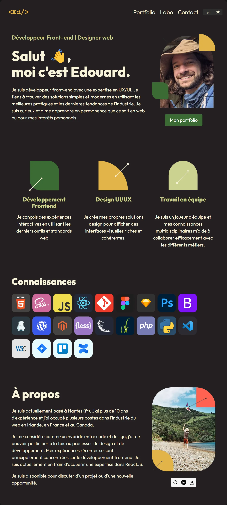

# Personal website

This is my personal portfolio. I built it with using Figma for the design process and ReactJS with Bulma for the dev.
It is bootstraped with Vite.js.

🔗 **Live preview:** [here](http://edouard.desgree.com)

### Screenshot

## Built with

### Technologies

- HTML
- CSS
- React JS

### Tools

- Vite
- Bulma

## Features

- Display of some of the projects i worked on in a component list
- Use of translation english/french (using useState)
- All data is stored in a local .js file
- Dark/light mode
- Animation between react components using [Framer motion](https://www.framer.com/motion/examples/)
- Routes using [react-router v6](https://reactrouter.com/)
- svg import and updates via css

## Author

👤 **Edouard Desgrée**

- GitHub: [edesgree](https://github.com/edesgree)
